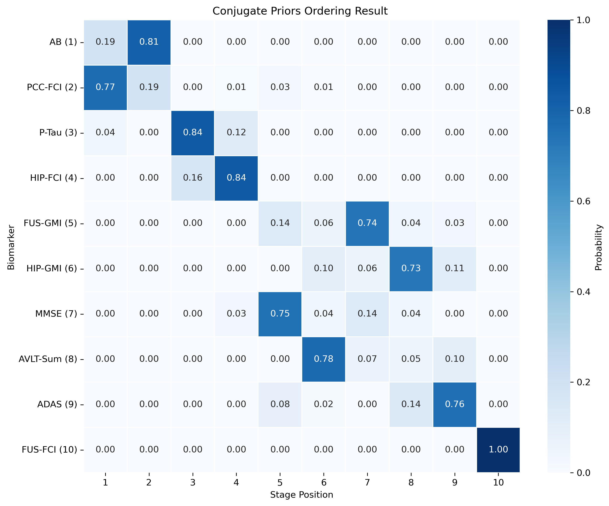

# `sa_ebm` 

`sa_ebm` is the `python` package for the paper of "Stage-Aware Event-Based Modeling (SA-EBM) for Disease Progression"

## Installation

```bash
pip install sa_ebm
```

## Data generation

Examples of how to generate data is at [./sa_ebm/test/gen.py](./sa_ebm/test/gen.py).

Because in each generation, the ordering is randomized, you will see a `true_order_and_stages.json` that tells you the corresponding true stages and true order for each output csv file.

The source codes for data generation can be seen in [./sa_ebm/utils/generate_data.py](./sa_ebm/utils/generate_data.py).

This is the full `generate` parametesr:

```py
generate(
    experiment_name: str = "sn_kjOrdinalDM_xnjNormal",
    params_file: str = 'params.json',
    js: List[int] = [50, 200, 500, 1000],
    rs: List[float] = [0.1, 0.25, 0.5, 0.75, 0.9],
    num_of_datasets_per_combination: int = 50,
    output_dir: str = 'data',
    seed: Optional[int] = None,
    dirichlet_alpha: Optional[Dict[str, List[float]]] = {
        'uniform': [100], 
        'multinomial':[0.4013728324975898,
                      1.0910444770153345,
                      2.30974117596663,
                      3.8081194066281103,
                      4.889722107892335,
                      4.889722107892335,
                      3.8081194066281103,
                      2.30974117596663,
                      1.0910444770153345,
                      0.4013728324975898]
    },
    beta_params: Dict[str, Dict[str, float]] = {
        'near_normal': {'alpha': 2.0, 'beta': 2.0},
        'uniform': {'alpha': 1, 'beta': 1},
        'regular': {'alpha': 5, 'beta': 2}
    },
    prefix: Optional[str] = None,
    suffix: Optional[str] = None,
    keep_all_cols: bool = False 
)
```

Explanations:
- `experiment_name` should be one of the these:

```py
experiment_names = [
    "sn_kjOrdinalDM_xnjNormal",     # Experiment 1: Ordinal kj with Dirichlet-Multinomial, Normal Xnj
    "sn_kjOrdinalDM_xnjNonNormal",  # Experiment 2: Ordinal kj with Dirichlet-Multinomial, Non-Normal Xnj
    "sn_kjOrdinalUniform_xnjNormal", # Experiment 3: Ordinal kj with Uniform distribution, Normal Xnj
    "sn_kjOrdinalUniform_xnjNonNormal", # Experiment 4: Ordinal kj with Uniform distribution, Non-Normal Xnj
    "sn_kjContinuousUniform",       # Experiment 5: Continuous kj with Uniform distribution
    "sn_kjContinuousBeta",          # Experiment 6: Continuous kj with Beta distribution
    "xiNearNormal_kjContinuousUniform", # Experiment 7: Near-normal Xi with Continuous Uniform kj
    "xiNearNormal_kjContinuousBeta", # Experiment 8: Near-normal Xi with Continuous Beta kj
    "xiNearNormalWithNoise_kjContinuousBeta", # Experiment 9: Same as Exp 8 but with noises to xi
]
```

You can find the explanationn to these terms from our paper. 

- `params_file`: The path to the parameters in json. Example is [./sa_ebm/data/params.json](./sa_ebm/data/params.json). You should specify each biomarker's `theta_mean`, `theta_std`, `phi_mean`, and `phi_std`. 

- `js`: An array of intergers indicating the number of participants you want. 

- `rs`: An array of floats indicating the number of healthy ratios. 

- `num_of_datasets_per_combination`: The number of repititions for each j-r combination. 

- `output_dir`: The directory where you want to save the generated data. 

- `seed`: An interger serving as the seed for the randomness. 

- `dirichlet_alpha`: This should be a dictionary where keys are `uniform` and `multinomial`. They correspond to `kjOrdinalUniform` and `kjOrdinalDM`. 

- `beta_params`: A dictionary where keys are `near_normal`, `uniform`, and `regular`, corresponding to `xiNearNormal`, `kjContinuousUniform` and `kjContinuousBeta`. 

- `prefix`: Optional prefix for the output csv file names. 

- `suffix`: Optional suffix for the output csv file names. 

- `keep_all_cols`: Whether to include additional metadata columns (k_j, event_time, affected)

## Run EBM Algorithms 

Examples of how to run aglorithms and get results is at [./sa_ebm/test/test.py](./sa_ebm/test/test.py).

This explains the parametesr well enough:

```py
def run_ebm(
    data_file: str,
    output_dir: str,
    algorithm: str = 'conjugate_priors', 
    n_iter: int = 2000,
    n_shuffle: int = 2,
    burn_in: int = 500,
    thinning: int = 10,
    true_order_dict: Optional[Dict[str, int]] = None,
    true_stages: Optional[List[int]] = None,
    plot_title_detail: Optional[str] = "",
    fname_prefix: Optional[str] = "",
    skip_heatmap: Optional[bool] = False,
    skip_traceplot: Optional[bool] = False,
    prior_n: float = 1.0,    # Strength of the prior belief in prior estimate of the mean (μ), set to 1 as default
    prior_v: float = 1.0,     # Prior degrees of freedom, influencing the certainty of prior estimate of the variance (σ²), set to 1 as default
    weight_change_threshold: float = 0.01
) -> Dict[str, float]:
    """
    Run the metropolis hastings algorithm and save results 

    Args:
        data_file (str): Path to the input CSV file with biomarker data.
        output_dir (str): Path to the directory to store all the results.
        algorithm (str): Choose from 'hard_kmeans', 'mle', 'em', 'kde', and 'conjugate_priors' (default).
        n_iter (int): Number of iterations for the Metropolis-Hastings algorithm.
        n_shuffle (int): Number of shuffles per iteration.
        burn_in (int): Burn-in period for the MCMC chain.
        thinning (int): Thinning interval for the MCMC chain.
        true_order_dict (Optional[Dict[str, int]]): biomarker name: the correct order of it (if known)
        true_stages (Optional[List[int]]): true stages for all participants (if known)
        plot_title_detail (Optional[str]): optional string to add to plot title. 
        fname_prefix (Optional[str]): the prefix of heatmap, traceplot, results.json, and logs file, e.g., 5_50_0_heatmap_conjugate_priors.png
            In the example, there are no prefix strings. 
        skip_heatmap (Optional[bool]): whether to save heatmaps. True if want to skip saving heatmpas and save space.
        skip_traceplot (Optional[bool]): whether to save traceplots. True if want to skip saving traceplots and save space.
        prior_n (strength of belief in prior of mean): default to be 1.0
        prior_v (prior degree of freedom) are the weakly infomred priors, default to be 1.0
        weight_change_threshold (float): Threshold for kde weights (if np.mean(new_weights - old_weights)) > threshold, then recalculate
            otherwise use the new kde and weights

    Returns:
        Dict[str, float]: Results including Kendall's tau and p-value.
    """
```

Some extra explanations:

- `n_iter`: In generally, above 2k is recommended. 10k should be sufficient if you have <= 10 biomarkers. 
- `burn_in` and `thinning`: The idea behind the two parameters is that we will only use some of the results from all iterations in `n_iter`. We will do this: if `(i > burn_in) & (i % thinning == 0)`, then we will use result from that iteration `i`.

After running the `run_ebm`, you'll see a folder named as your `output_dir`. Each algorithm will have its subfolders. 

The results are organized this way:

- `records` folder contains the loggings. 
- `heatmpas` folder contains all the heatmaps. An example is 



    Biomarkers in the y-axis are ranked according to the ordering that has the highest likelihood among all iterations. Each cell indicates the probability that a certain biomarker falls in a certain stage. **Note, however, these probabilities are calculated based on all the iterations that satisfy  `(i > burn_in) & (i % thinning == 0)`**.

    In the heatmap, the sum of each col and each row is 1. 

- `traceplots` folder contains all the traceplots (starting from iteration 40, not iteration 0). Those plots will be useful to diagnoise whethere EBM algorithms are working correctly. It's totally okay for the plots to show fluctuation (because biomarker distribution and stage distributions are re-calculated each iterations). You should not, however, see a clear downward trend. 

- `results` folder contains all important results in `json`. Each file contains

```py
results = {
        "algorithm": algorithm,
        "N_MCMC": n_iter,
        "n_shuffle": n_shuffle, 
        "burn_in": burn_in,
        "thinning": thinning,
        "kendalls_tau": tau, 
        "p_value": p_value,
        "quadratic_weighted_kappa": qwk,
        "mean_absolute_error": mae,
        "mean_squared_error": mse,
        "root_mean_squared_error": rmse,
        'true_order': {k:int(v) for k, v in true_order_dict.items()},
        'ml_order': {k:int(v) for k, v in most_likely_order_dic.items()},
        "order_with_higest_ll": {k: int(v) for k, v in order_with_higest_ll.items()},
        "kendalls_tau2": tau2,
        "p_value2": p_value2,
        "true_stages": true_stages,
        'ml_stages': ml_stages,
        "stage_likelihood_posterior": {str(k): v.tolist() for k, v in final_stage_post.items()},
        "final_theta_phi_params": final_theta_phi_params,
    }
```

- `kendalls_tau` and `p_value` are the result of comparing the `ml_order` (most likely order) with the true order (if provided). 
- `ml_order` is the overall most likely order considering results from all the iterations that satisfy  `(i > burn_in) & (i % thinning == 0)`. 
- `true_order` is the dictionary explaning the stage each biomarker is at. 
- `kendalls_tau2` and `p_values` are the result of comparing the `order_with_highest_ll` with the true order (if provided).
- `quadratic_weighted_kappa`, `mean_absolute_error`, `mean_squared_error` and `root_mean_squared_error` are the results of comparing `ml_stages` and `true_stages` (if provided).
- `true_stages` is an array of each participant's disease stage. 
- `ml_stages` is the array of most likely disease stages. 
- `stage_likelihood_posterior` is a dictionary detailing each participant's probability in each of the possible stages. 
- `final_theta_phi_params` is a dictionary detailing the parameters for each biomarker. If you are using `kde`, then you will see `theta_kde` and `phi_kde`, each of which contains data poins, weights, and bandwiths (*I AM NOT SURE HERE! HAVE TO DOUBLE CHECK!*). If you use other algorithms, you will see the `theta_mean`, `theta_std`, `phi_mean` and `phi_std`.

## Use your own data

You are more than welcome to use your own data! That's the sole purpose of `sa_ebm`: to allow you to analyze your own data. However, you do have to make sure that the input data have at least four columns:

- participant: int
- biomarker: str
- measurement: float
- diseased: bool 

Samples are available at [./sa_ebm/data/samples/](./sa_ebm/data/samples/).

The data should be in a [tidy format](https://vita.had.co.nz/papers/tidy-data.pdf), i.e.,

- Each variable is a column. 
- Each observation is a row. 
- Each type of observational unit is a table. 


## Change Log

- 2025-02-26 (V 0.3.4). 
    - Modified the `shuffle_order` function to ensure full derangement, making convergence faster. 
- 2025-03-06 (V 0.4.0)
    - use `pyproject.toml` instead
    - update `conjuage_priors_algo.py`, now without using the auxiliary variable of `participant_stages`. Kept the uncertainties just like in `soft_kmeans_algo.py`. 
- 2025-03-07 (V 0.4.2)
    - Compute `new_ln_likelihood_new_theta_phi` based on `new_theta_phi_estimates`, which is based on `stage_likelihoods_posteriors` that is based on the newly proposed order and previous `theta_phi_estimates`.
    - Update `theta_phi_estimates` with `new_theta_phi_estimates` only if new order is accepted.
    - The fallback theta_phi_estimates is the previous parameters rather than theta_phi_default 
    - `all_accepted_orders.append(current_order_dict.copy())` to make sure the results are not mutated. 
    - Previously I calculated the `new_ln_likelihood` and `stage_likelihoods_posteriors` based on the newly proposed order and previous `theta_phi_estimates`, and directly update theta_phi_estimates whether we accept the new order or not. 
    - Previously, I excluded `copy()` in `all_accepted_orders.append(current_order_dict.copy())`, which is inaccurate. 
- 2025-03-17 (V 0.4.3)
    - Added `skip` and `title_detail` parameter in `save_traceplot` function. 
- 2025-03-18 (V 0.4.4)
    - Add optional horizontal bar indicating upper limit in trace plot. 
- 2025-03-18 (V 0.4.7)
    - Allowed keeping all cols (`keep_all_cols`) in data generation. 
- 2025-03-18 (V 0.4.9)
    - copy `data_we_have` and use `data_we_have.loc[:, 'S_n']` in soft kmeans algo when preprocessing participant and biomarker data.
- 2025-03-20 (V 0.5.1)
    - In hard kmeans, updated `delta = ln_likelihood - current_ln_likelihood`, and in soft kmeans and conjugate priors, made sure I am using `delta = new_ln_likelihood_new_theta_phi - current_ln_likelihood`.
    - In each iteration, use `theta_phi_estimates = theta_phi_default.copy()` first. This means, `stage_likelihoods_posteriors` is based on the default theta_phi, not the previous iteration. 
- 2025-03-21 (V 0.6.0)
    - Integrated all three algorithms to just one file `algorithms/algorithm.py`. 
    - Changed the algorithm name of `soft_kmeans` to `mle` (maximum likelihood estimation)
    - Moved all helper functions from the algorithm script to `utils/data_processing.py`. 
- 2025-03-22 (V 0.7.6)
    - Current state should include both the current accepted order and its associated theta/phi. When updating theta/phi at the start of each iteration, use the current state's theta/phi (1) in the calculation of stage likelihoods and (2) as the fallback if either of the biomarker's clusters is empty or has only one measurement; (3) as the prior mean and variance. 
    - Set `conjugate_priors` as the default algorithm. 
    - (Tried using cluster's mean and var as the prior but the results are not as good as using current state's theta/phi as the prior). 
- 2025-03-24 (V 0.7.8)
    - In heatmap, reorder the biomarkers according to the most likely order. 
    - In `results.json` reorder the biomarker according to their order rather than alphabetically ranked. 
    - Modified `obtain_most_likely_order_dic` so that we assign stages for biomarkers that have the highest probabilities first. 
    - In `results.json`, output the order associated with the highest total log likelihood. Also, calculate the kendall's tau and p values of it and the original order (if provided).
- 2025-03-25 (V 0.8.1)
    - In heatmap, reorder according to the order with highest log likelihood. Also, add the number just like (1).
    - Able to add title detail to heatmaps and traceplots. 
    - Able to add `fname_prefix` in `run_ebm()`. 
- 2025-03-29 (V 0.8.9)
    - Added `em` algorithm. 
    - Added Dirichlet-Multinomial Model to describe uncertainy of stage distribution (a multinomial disribution of all disease stages; because we cannot always assume all disease stages are equally likely).
    - `prior_v` default set to be 1. 
    - Default to use dirichlet distribution instead of uniform distribution 
    - Change data filename from 50|100_1 to 50_100_1. 
    - Modified the `mle` algorithm to make sure the output does not contain `np.nan` (by using the fallback).

- 2025-03-30 (V 0.9.2)
    - Completed changed `generate_data.py`. Now incorporates the modified data generation model based on DEBM2019.
    - Rank the original order by the value (ascending), if original order exists. 
    - Able to skip saving traceplots and/or heatmaps.

- 2025-03-31 (V 0.9.4)
    - Able to store final theta phi estimates and the final stage likelihood posteior to results.json

- 2025-04-02 (V 0.9.5)
    - Added `kde` algorithm. 
    - Initial kmeans used seeded Kmeans + conjugate priors. 

- 2025-04-03 (V 0.9.7)
    - Improved kde. 
    - Added dirichlet and beta parameters randomization. 

- 2025-04-05 (V 0.9.9)
    - Updated `generate_data.py` to align with the experimental design.

- 2025-04-06 (V 0.9.9.3)
    - Make `kmeans.py` more robust. Now try 100 times to randomize the assignment for the diseased group if the initial kmeans failed.
    - Add `algorithm` and `ml_order` in `results.json`
    - After generating data, create `true_order_and_stages_dict` to store all filenames' true biomarker order and all participants' stages. For continuous kjs, use `bisect_right` algorithm to get the ranking order. 

- 2025-04-07 (V 0.9.9.9)
    - Modified `generate_data.py` to allow Experiment 9. 
    - In `generate_data.py`, added the function of randomly flipping the direction of progression in the sigmoid model. Also made sure this random direction is consistant across participants.
    - In the spirt of "Do not repeat yourself", delete "R" and "rho" in params.json. Instead, compute it each time when I generate data. The time difference is minimal.
    - Added comparisons between true stages and most likely stages
    - Reorganized the results.json
    - Allow `output_dir` in `run_ebm`. 

- 2025-04-08 (V 1.00)
    - Modify the FastKDE implementation. 
    - Reoraganized the `results.json`. 
    - Added `stage_post` to hard kmeans as well. Now that every algorithm can output ml_stages.
    - Made sure diseased stages are between `(, max_stage]`.

- 2025-04-13 (V 1.1)
    - Leveraged weights when calculating bandwidth in `FastKDE`.

- 2025-04-14 (V 1.11)
    - Updated the `fastkde.py`. 
<!-- 

## Generate Random Data

```py
from alabebm import generate, get_params_path, get_biomarker_order_path
import os
import json 

# Get path to default parameters
params_file = get_params_path()

# Get path to biomarker_order
biomarker_order_json = get_biomarker_order_path()

with open(biomarker_order_json, 'r') as file:
    biomarker_order = json.load(file)

generate(
    biomarker_order = biomarker_order,
    real_theta_phi_file=params_file,  # Use default parameters
    js = [50, 100],
    rs = [0.1, 0.5],
    num_of_datasets_per_combination=2,
    output_dir='my_data',
    seed = None,
    prefix = None,
    suffix = None,
    keep_all_cols = False
)
```

## Run MCMC Algorithms 

```py
from alabebm import run_ebm
from alabebm.data import get_sample_data_path
import os

print("Current Working Directory:", os.getcwd())

for algorithm in ['soft_kmeans', 'conjugate_priors', 'hard_kmeans']:
    results = run_ebm(
        data_file=get_sample_data_path('25|50_10.csv'),  # Use the path helper
        algorithm=algorithm,
        n_iter=2000,
        n_shuffle=2,
        burn_in=1000,
        thinning=20,
        correct_ordering = None,
        plot_title_detail = "",
    )
```

## Interpreting the results 

After running the algorithm, you'll get the results in the folder of `conjugate_priors`, including 

- `heatmaps`. This folder contains the heatmap. Note that the number following each biomarker, such as (1), indicates the order of this biomarker according to the order that is associated with the highest likelihood (You can see the folder of `traceplots` for the likelihood history.)
- `records` contains the logging information of the algorithm. 
- `traceplots` contains the traceplots of log likelihood trajectory. 
- `results` contains json files. Example of a result json:

```json
{
    "n_iter": 200,
    "most_likely_order": {
        "HIP-FCI": 1,
        "PCC-FCI": 2,
        "FUS-GMI": 3,
        "P-Tau": 4,
        "AB": 5,
        "HIP-GMI": 6,
        "MMSE": 7,
        "ADAS": 8,
        "AVLT-Sum": 9,
        "FUS-FCI": 10
    },
    "kendalls_tau": 0.6,
    "p_value": 0.016666115520282188,
    "original_order": {
        "HIP-FCI": 1,
        "PCC-FCI": 2,
        "AB": 3,
        "P-Tau": 4,
        "MMSE": 5,
        "ADAS": 6,
        "HIP-GMI": 7,
        "AVLT-Sum": 8,
        "FUS-GMI": 9,
        "FUS-FCI": 10
    },
    "order_with_higest_ll": {
        "HIP-FCI": 1,
        "PCC-FCI": 2,
        "FUS-GMI": 3,
        "AB": 4,
        "P-Tau": 5,
        "HIP-GMI": 6,
        "MMSE": 7,
        "ADAS": 8,
        "AVLT-Sum": 9,
        "FUS-FCI": 10
    },
    "kendalls_tau2": 0.6444444444444444,
    "p_value2": 0.009148478835978836
}
```

`n_iter` means the number of iterations. `most_likely_order` is the most likely order if we consider all the iteration results, burn in, and thinning. `kendalls_tau` and `p_value` is the result of most likely order versus the original order (if provided). `order_with_higest_ll` is the order associated with the highest log likelihood. `kendalls_tau2` and `p_value2` is the result of most likely order versus the original order (if provided).  -->


<!-- 
## Features

- Multiple MCMC algorithms:
    - Conjugate Priors
    - Hard K-means
    - MLE

- Data generation utilities
- Extensive logging -->


